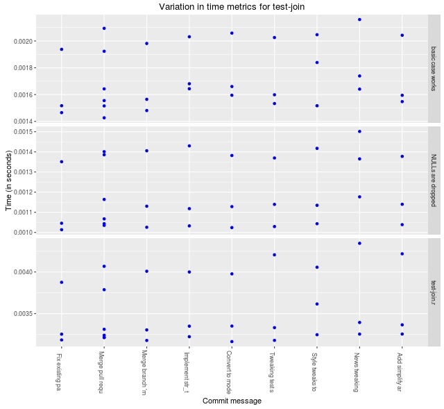
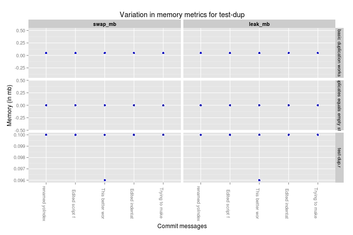

Rperform
--------

[](https://travis-ci.org/analyticalmonk/Rperform)


Rperform is an R package that makes it easy for R package developers to track quantitative performance metrics of their code, over time. <b>It focuses on providing changes, related to time and memory, brought over in the package’s performance metrics over subsequent development versions and across git branches.</b>
Also, you can use Rperform with travis-ci to do performance testing during your travis build by adding some sample scripts to your git repository. It can prove to be particularly useful while measuring the possible changes which can be introduced by a pull request (PR). Detailed instructions for doing that can be found on the wiki link provided below.

**_For integrating Rperform with your travis build, check out the instructions provided on the [Rperform Wiki](https://github.com/analyticalmonk/Rperform/wiki/Integrating-Rperform-with-Travis-CI)_**.

<em>The project was initiated as a part of the [Google Summer of Code 2015](https://github.com/rstats-gsoc/gsoc2015/wiki/Test-timings-on-Travis) program.</em><br>
<em>The project has been accepted into the [Google Summer of Code 2016](https://github.com/rstats-gsoc/gsoc2016/wiki/Rperform:-Performance-analysis-of-R-package-code) program.</em>


Installation
------------

To get started, you can install the package from github using `devtools`*.

``` r
library(devtools)
install_github("analyticalmonk/Rperform")
```
or,
```r
devtools::install_github("analyticalmonk/Rperform")
```

*Follow the instructions on the [devtools README](https://github.com/hadley/devtools#updating-to-the-latest-version-of-devtools) to install the latest version.

Examples
--------

_For detailed information regarding Rperform's plotting functions, check out the **[Rperform Wiki](https://github.com/analyticalmonk/Rperform/wiki/Plotting-package-metrics-with-Rperform)**._

<b>IMPORTANT</b>: The Rperform package requires you to set the current directory to the concerned 
git repository before using the functions.

```r
> setwd(dir = "Path/to/repo")
```

The following examples illustrates the use of the `Rperform::plot_metrics()` function on the git repository of the package [stringr](https://github.com/tdhock/stringr).

```r
> setwd("./stringr")
> library(Rperform)
> plot_metrics(test_path = "./tests/testthat/test-extract.r", num_commits = 10, save_data = FALSE, save_plots = FALSE)
```


```r
> Rperform::plot_metrics(test_path = "./tests/testthat/test-dup.r", metric = "memory", num_commits = 5, save_data = F, save_plots = F)
```



The following example illustrates the use of the `Rperform::time_compare()` and `Rperform::mem_compare()` functions on the git repository
of the package [stringr](https://github.com/tdhock/stringr).

```r
> setwd("./stringr")
> library(Rperform)
> time_compare(test_path = "./tests/testthat/test-dup.r", num_commits = 2)

                          test_name metric_name status  metric_val         msg_val           date_time
1           basic duplication works        time   pass 0.001797014 Can now use CRA 2015-01-08 14:09:43
2           basic duplication works        time   pass 0.001539050 Can now use CRA 2015-01-08 14:09:43
3           basic duplication works        time   pass 0.001545034 Can now use CRA 2015-01-08 14:09:43
4  0 duplicates equals empty string        time   pass 0.001019430 Can now use CRA 2015-01-08 14:09:43
5  0 duplicates equals empty string        time   pass 0.000784386 Can now use CRA 2015-01-08 14:09:43
6  0 duplicates equals empty string        time   pass 0.000766279 Can now use CRA 2015-01-08 14:09:43
7                        test-dup.r        time   pass 0.003555478 Can now use CRA 2015-01-08 14:09:43
8                        test-dup.r        time   pass 0.003118946 Can now use CRA 2015-01-08 14:09:43
9                        test-dup.r        time   pass 0.003106017 Can now use CRA 2015-01-08 14:09:43
10          basic duplication works        time   pass 0.001780849 Require latest  2015-01-08 14:03:37
11          basic duplication works        time   pass 0.001545568 Require latest  2015-01-08 14:03:37
12          basic duplication works        time   pass 0.001517300 Require latest  2015-01-08 14:03:37
13 0 duplicates equals empty string        time   pass 0.001028882 Require latest  2015-01-08 14:03:37
14 0 duplicates equals empty string        time   pass 0.000783847 Require latest  2015-01-08 14:03:37
15 0 duplicates equals empty string        time   pass 0.000771520 Require latest  2015-01-08 14:03:37
16                       test-dup.r        time   pass 0.003436051 Require latest  2015-01-08 14:03:37
17                       test-dup.r        time   pass 0.003130397 Require latest  2015-01-08 14:03:37
18                       test-dup.r        time   pass 0.003082713 Require latest  2015-01-08 14:03:37
> 
```

```r
> Rperform::mem_compare(test_path = "./tests/testthat/test-join.r", num_commits = 1)

             test_name metric_name status metric_val         msg_val           date_time
11.1  basic case works     max_mem_mb   pass      0.040 Can now use CRA 2015-01-08 14:09:43
11.2  basic case works     leak_mb      pass      0.040 Can now use CRA 2015-01-08 14:09:43
11.3 NULLs are dropped     max_mem_mb   pass      0.044 Can now use CRA 2015-01-08 14:09:43
11.4 NULLs are dropped     leak_mb      pass      0.044 Can now use CRA 2015-01-08 14:09:43
11.5       test-join.r     max_mem_mb   pass      0.148 Can now use CRA 2015-01-08 14:09:43
11.6       test-join.r     leak_mb      pass      0.148 Can now use CRA 2015-01-08 14:09:43
12.1  basic case works     max_mem_mb   pass      0.040 Can now use CRA 2015-01-08 14:09:43
12.2  basic case works     leak_mb      pass      0.040 Can now use CRA 2015-01-08 14:09:43
12.3 NULLs are dropped     max_mem_mb   pass      0.044 Can now use CRA 2015-01-08 14:09:43
12.4 NULLs are dropped     leak_mb      pass      0.044 Can now use CRA 2015-01-08 14:09:43
12.5       test-join.r     max_mem_mb   pass      0.144 Can now use CRA 2015-01-08 14:09:43
12.6       test-join.r     leak_mb      pass      0.144 Can now use CRA 2015-01-08 14:09:43
13.1  basic case works     max_mem_mb   pass      0.040 Can now use CRA 2015-01-08 14:09:43
13.2  basic case works     leak_mb      pass      0.040 Can now use CRA 2015-01-08 14:09:43
13.3 NULLs are dropped     max_mem_mb   pass      0.048 Can now use CRA 2015-01-08 14:09:43
13.4 NULLs are dropped     leak_mb      pass      0.048 Can now use CRA 2015-01-08 14:09:43
13.5       test-join.r     max_mem_mb   pass      0.148 Can now use CRA 2015-01-08 14:09:43
13.6       test-join.r     leak_mb      pass      0.148 Can now use CRA 2015-01-08 14:09:43
```

---

<!-- README.md is generated from README.Rmd. Please edit that file -->
