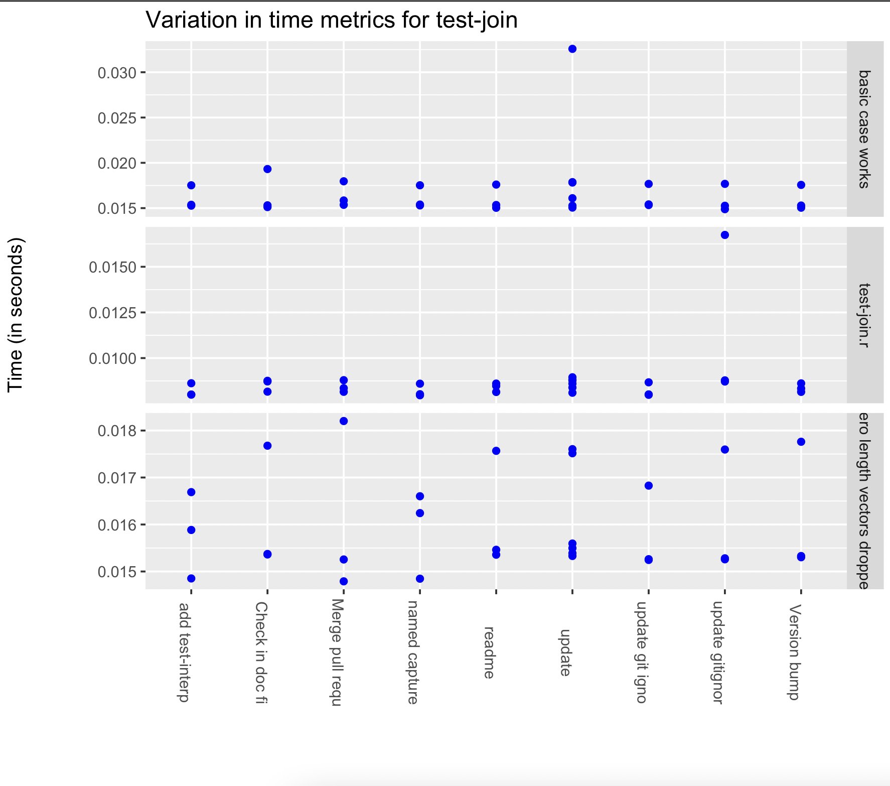
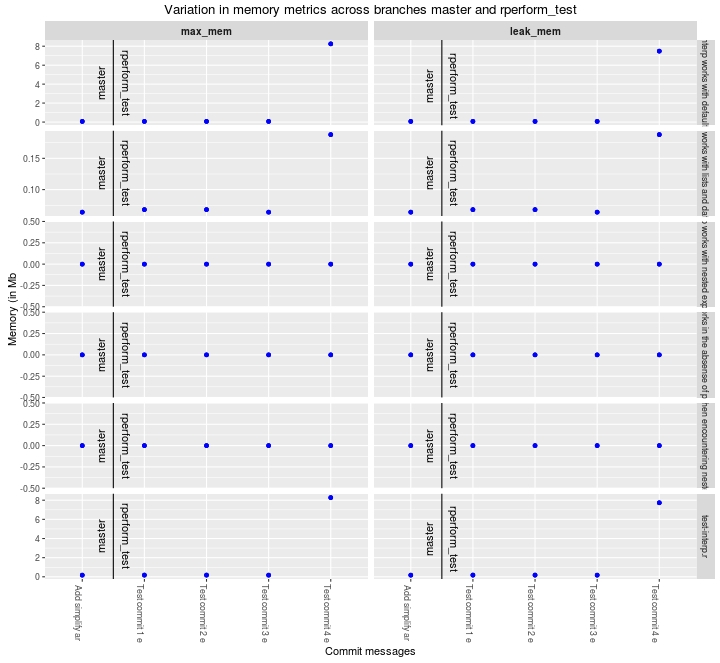

<!-- README.md is generated from README.Rmd. Please edit that file -->

# Rperform

[](https://github.com/analyticalmonk/Rperform/actions)

Rperform is a package that allows R developers to track quantitative performance metrics of their code. It focuses on providing changes in a package’s performance metrics, related to runtime and memory, over different git versions and across git branches. Rperform can be integrated with Travis-CI to do performance testing during Travis builds by making changes to the repo’s .travis.yml file. **It can prove to be particularly useful while measuring the possible changes which can be introduced by a pull request (PR).**

***For integrating Rperform with your travis build, check out the instructions provided on the [Rperform Wiki](https://github.com/analyticalmonk/Rperform/wiki/Integrating-Rperform-with-Travis-CI)***.

***For more information, tutorials and related blog posts, go through the [Rperform wiki](https://github.com/analyticalmonk/Rperform/wiki/Integrating-Rperform-with-Travis-CI).***

\*The project was initiated as a part of the [Google Summer of Code 2015](https://github.com/rstats-gsoc/gsoc2015/wiki/Test-timings-on-Travis) program and accepted into [Google Summer of Code 2016](https://github.com/rstats-gsoc/gsoc2016/wiki/Rperform:-Performance-analysis-of-R-package-code) program.

\*The project has also been accepted into the [Google Summer of Code 2022](https://github.com/rstats-gsoc/gsoc2022/wiki/Rperform) program with [Toby Dylan Hocking](https://github.com/tdhock), [Akash Tandon](https://github.com/analyticalmonk) and [Randy Lai](mailto:randy.cs.lai@gmail.com) as the mentors.

# Installation

-   You can install the package from github using `devtools`\*.

<!-- end list -->

``` r
library(devtools)
install_github("analyticalmonk/Rperform")
```

or,

``` r
devtools::install_github("analyticalmonk/Rperform")
```

# Basic examples

*For detailed information regarding Rperform’s plotting functions, check out the [**Wiki**](https://github.com/analyticalmonk/Rperform/wiki/Plotting-package-metrics-with-Rperform).*

**IMPORTANT**: The Rperform package requires you to set the current directory to the concerned git repository before using the functions.

``` r
> setwd(dir = "Path/to/repo")
```

-   The following example illustrates the use of the `Rperform::plot_metrics()` function on the git repository of the package [stringr](https://github.com/EngineerDanny/stringr).

<!-- end list -->

``` r
> setwd("./stringr")
> library(Rperform)
> plot_metrics(test_path = "inst/tests/test-join.r", metric = "time", num_commits = 10, save_data = FALSE, save_plots = FALSE)
```



-   The following example illustrates the use of the `Rperform::plot_branchmetrics()` function on the git repository of the package [stringr](https://github.com/EngineerDanny/stringr).

<!-- end list -->

``` r
> setwd("./stringr")
> library(Rperform)
> plot_branchmetrics(test_path = "inst/tests/test-interp.r", metric = "memory", branch1 = "rperform_test", branch2 = "master", save_data = F, save_plots = F)
```



-   The following example illustrates the use of the `Rperform::time_compare()` and `Rperform::mem_compare()` functions on the git repository of the package [stringr](https://github.com/EngineerDanny/stringr).

<!-- end list -->

``` r
> setwd("./stringr")
> library(Rperform)
> time_compare(test_path = "inst/tests/test-dup.r", num_commits = 2)

                          test_name          metric_name status metric_val  message          date_time
1           basic duplication works runtime (in seconds)   pass 0.02904030  update           2022-06-28 09:38:26      
2           basic duplication works runtime (in seconds)   pass 0.02910049  update           2022-06-28 09:38:26     
3           basic duplication works runtime (in seconds)   pass 0.03021192  update           2022-06-28 09:38:26     
4  0 duplicates equals empty string runtime (in seconds)   pass 0.01538062  update           2022-06-28 09:38:26    
5  0 duplicates equals empty string runtime (in seconds)   pass 0.01498333  update           2022-06-28 09:38:26 
6  0 duplicates equals empty string runtime (in seconds)   pass 0.01516619  update           2022-06-28 09:38:26  
7                        test-dup.r runtime (in seconds)   pass 0.01260504  update           2022-06-28 09:38:26
8                        test-dup.r runtime (in seconds)   pass 0.01253468  update           2022-06-28 09:38:26
9                        test-dup.r runtime (in seconds)   pass 0.01240689  update           2022-06-28 09:38:26
10          basic duplication works runtime (in seconds)   pass 0.02921783  update git igno  2022-06-28 09:25:42
11          basic duplication works runtime (in seconds)   pass 0.02894895  update git igno  2022-06-28 09:25:42
12          basic duplication works runtime (in seconds)   pass 0.03001007  update git igno  2022-06-28 09:25:42
13 0 duplicates equals empty string runtime (in seconds)   pass 0.01586163  update git igno  2022-06-28 09:25:42
14 0 duplicates equals empty string runtime (in seconds)   pass 0.01525475  update git igno  2022-06-28 09:25:42
15 0 duplicates equals empty string runtime (in seconds)   pass 0.01512830  update git igno  2022-06-28 09:25:42
16                       test-dup.r runtime (in seconds)   pass 0.01266998  update git igno  2022-06-28 09:25:42
17                       test-dup.r runtime (in seconds)   pass 0.01242419  update git igno  2022-06-28 09:25:42
18                       test-dup.r runtime (in seconds)   pass 0.01267261  update git igno  2022-06-28 09:25:42
> 
```

``` r
> Rperform::mem_compare(test_path = "inst/tests/test-join.r", num_commits = 1)

             test_name metric_name status metric_val         msg_val           date_time
11.1  basic case works     max_mem_mb   pass      0.040 Can now use CRA 2015-01-08 14:09:43
11.2  basic case works     leak_mb      pass      0.040 Can now use CRA 2015-01-08 14:09:43
11.3 NULLs are dropped     max_mem_mb   pass      0.044 Can now use CRA 2015-01-08 14:09:43
11.4 NULLs are dropped     leak_mb      pass      0.044 Can now use CRA 2015-01-08 14:09:43
11.5       test-join.r     max_mem_mb   pass      0.148 Can now use CRA 2015-01-08 14:09:43
11.6       test-join.r     leak_mb      pass      0.148 Can now use CRA 2015-01-08 14:09:43
12.1  basic case works     max_mem_mb   pass      0.040 Can now use CRA 2015-01-08 14:09:43
12.2  basic case works     leak_mb      pass      0.040 Can now use CRA 2015-01-08 14:09:43
12.3 NULLs are dropped     max_mem_mb   pass      0.044 Can now use CRA 2015-01-08 14:09:43
12.4 NULLs are dropped     leak_mb      pass      0.044 Can now use CRA 2015-01-08 14:09:43
12.5       test-join.r     max_mem_mb   pass      0.144 Can now use CRA 2015-01-08 14:09:43
12.6       test-join.r     leak_mb      pass      0.144 Can now use CRA 2015-01-08 14:09:43
13.1  basic case works     max_mem_mb   pass      0.040 Can now use CRA 2015-01-08 14:09:43
13.2  basic case works     leak_mb      pass      0.040 Can now use CRA 2015-01-08 14:09:43
13.3 NULLs are dropped     max_mem_mb   pass      0.048 Can now use CRA 2015-01-08 14:09:43
13.4 NULLs are dropped     leak_mb      pass      0.048 Can now use CRA 2015-01-08 14:09:43
13.5       test-join.r     max_mem_mb   pass      0.148 Can now use CRA 2015-01-08 14:09:43
13.6       test-join.r     leak_mb      pass      0.148 Can now use CRA 2015-01-08 14:09:43
```
